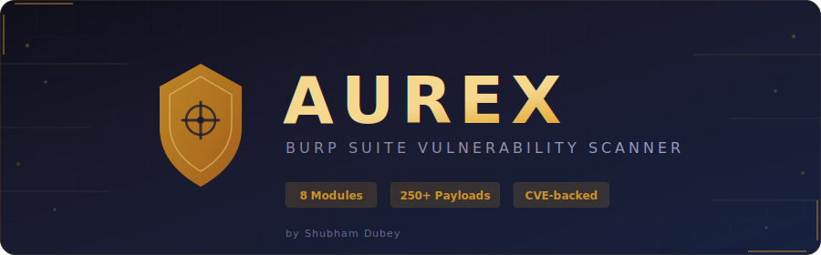

<p align="center">
  
</p>

# Aurex

**The scanner Burp Suite doesn't ship with.**

Every year PortSwigger publishes the Top 10 Web Hacking Techniques — the most impactful, novel attack classes discovered by researchers worldwide. Yet no scanner actually tests for them. Aurex does.

Drop in the JAR, run a scan, and Aurex automatically detects **8 attack classes** using **250+ payloads** mapped to **real CVEs**. No manual payload crafting. No guesswork.


---

## The Problem

Standard scanners check for SQLi, XSS, and the usual suspects. They miss the cutting-edge stuff — the techniques that actually win bug bounties and pop real targets in 2025:

- Template engines that execute `7*7` from user input
- ORM filters that leak `password` fields character by character
- Next.js middleware bypasses that skip auth entirely
- Unicode normalization that walks right through WAFs
- Redirect chains that reach cloud metadata endpoints
- Parser disagreements between frontends and backends
- HTTP/2 tunnels into internal services
- ETag headers that leak cross-origin data

**If your scanner doesn't test for these, you're leaving critical findings on the table.**

---

## What Aurex Finds

| Module | What it catches | Severity | Key CVEs |
|--------|----------------|----------|----------|
| **SSTI** | Template injection across 44 engines — polyglot, error-based, blind | Critical | CVE-2025-1302 |
| **ORM Leak** | Django, Prisma, OData, Harbor, Ransack filter abuse exposing sensitive fields | High | CVE-2023-22894, CVE-2025-30086 |
| **Next.js Cache** | Cache poisoning, middleware auth bypass, RSC confusion | High | CVE-2024-46982, CVE-2025-29927 |
| **Unicode** | NFKC/NFKD normalization WAF bypass for XSS, SQLi, path traversal | High | CVE-2024-43093, CVE-2025-52488 |
| **SSRF Redirect** | Redirect chain following to cloud metadata (169.254.169.254) | High | — |
| **Parser Diff** | Duplicate JSON keys, method override, content-type confusion | Medium | CVE-2021-42717 |
| **HTTP/2 CONNECT** | Tunnel probes to internal services through HTTP/2 | Medium | CVE-2025-49630 |
| **ETag XS-Leak** | Cross-site ETag length leak preconditions | Low | — |

---

## Install

```bash
gradle clean fatJar
```

1. Open Burp Suite (Pro or Community)
2. **Extensions → Add**
3. Select `build/libs/aurex-1.0.0.jar`
4. Done. The **Aurex** tab appears.

**Requirements:** Java 17+ / Burp Suite 2023.1+

---

## How It Works

Aurex hooks into Burp's scan pipeline. When you scan a target, each module runs automatically:

**SSTI** — Sends 4 polyglots that cover 44 template engines in one shot. If `49` appears in the response (and wasn't already there), it confirms injection. Then fingerprints the exact engine and tests blind variants.

**ORM Leak** — Probes filter parameters with Django/Prisma/OData/Ransack syntax. If the server accepts `password__startswith=a` and returns different results than `password__startswith=ZZZZZ`, that field is leaking. Then walks relational paths (`user__password`, `created_by__token`).

**Next.js Cache** — Fingerprints Next.js, then sends `x-middleware-prefetch`, `x-middleware-subrequest`, and cache-busting headers to test for poisoning and auth bypass.

**Unicode** — Sends fullwidth characters (like `\uFF1C` for `<`). If the server normalizes them to ASCII but the WAF doesn't block them, you have a bypass.

**SSRF Redirect** — Finds URL parameters, injects redirect targets pointing at internal services and cloud metadata endpoints, follows the chain.

**Parser Diff** — Sends duplicate JSON keys, `X-HTTP-Method-Override` headers, and conflicting content types to find disagreements between frontend and backend parsers.

**HTTP/2 CONNECT** — Detects HTTP/2 support, then sends CONNECT requests to probe internal service access through tunnel misconfigurations.

**ETag XS-Leak** — Checks if ETag headers combined with `If-None-Match` can be abused for cross-origin data length detection.

---

## Custom Payloads

Every payload is editable. Add your own through the UI or import JSON packs:

```json
[
  {
    "module": "ssti",
    "category": "polyglot",
    "value": "{{your_payload}}",
    "description": "Custom polyglot",
    "cveRefs": ["CVE-2025-XXXXX"],
    "enabled": true
  }
]
```

Payloads persist at `~/.burp_top10/payloads.json`. Export and share with your team.

---

## Built-in Tools

**ORM Extractor** — Manual character-by-character field extraction. Pick the ORM type, target field, and watch the value build live.

**SSRF Helper** — Generates ready-to-deploy redirect chain servers (Flask/Go) with configurable status codes and depth.

**Findings Export** — CSV and JSON export with severity, confidence, URL, and full detail for every finding.

---

## Why Aurex

- **Catches what others miss** — 8 attack classes that no other Burp extension covers together
- **CVE-backed payloads** — Every detection pattern traces back to a real vulnerability, not theoretical
- **Zero config** — Drop in the JAR, scan, get results
- **Fully extensible** — Add/edit/share payloads without touching code
- **Thread-safe** — Modules run in parallel, one crash never kills another
- **Lightweight** — Single ~430KB JAR, no external dependencies at runtime

---

## License

MIT

## Developed By

**Shubham Dubey**

[](https://github.com/ShubhamDubeyy/)
[](https://linkedin.com/in/shubham-dubeyy)

---

*For authorized security testing only. Only use against systems you have explicit permission to test.*
